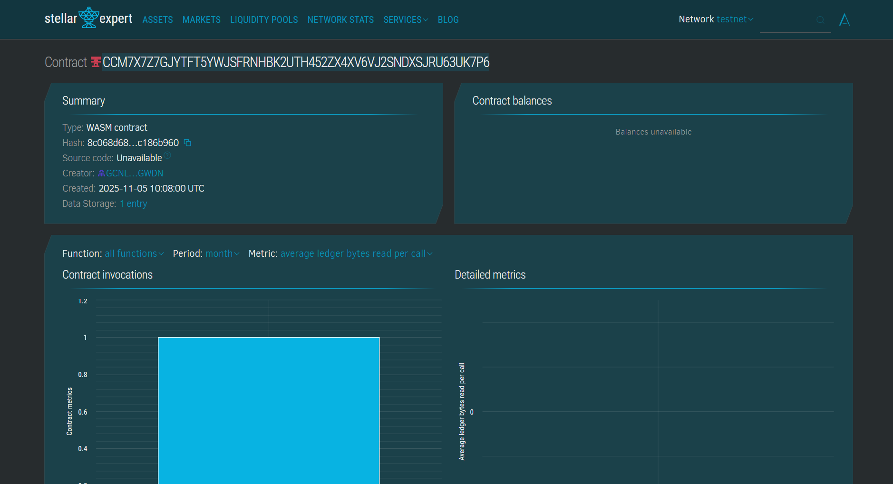

Here’s a clean, professional **README.md** file for your **Soroban NFT Ticketing Smart Contract** project — formatted in standard GitHub style with all requested sections included:

---

# 🎟️ Soroban NFT Event Ticketing Smart Contract

## 🧾 Project Title

**Decentralized NFT-Based Event Ticketing System on Soroban**

---

## 📖 Project Description

This project implements a **decentralized NFT ticketing smart contract** on the **Soroban** smart contract platform (built on the Stellar network).
Each event ticket is minted as a **unique, verifiable, and non-fungible token (NFT)**, assigned to a specific user and event. The contract ensures **secure ownership, transferability, and validation** of tickets without centralized intermediaries.

This smart contract eliminates issues like counterfeit tickets, duplicate entries, and ticket reselling scams by leveraging **blockchain immutability and transparency**.

---

## 🎯 Project Vision

The vision of this project is to create a **transparent and tamper-proof digital ticketing ecosystem** where event organizers and attendees can trust the authenticity of every ticket issued.
By integrating NFT technology with decentralized smart contracts, the system aims to replace traditional centralized ticketing systems with a **trustless, automated, and user-owned model**.

**Long-term goal:**
Enable full **Web3 ticketing infrastructure** for concerts, sports, and conferences — including event validation, resale tracking, and real-time on-chain verification.

---

## ✨ Key Features

### 1. 🪙 **Minting Unique NFT Tickets**

Each ticket is minted with a **unique ticket ID**, associated with an owner and event name. The system auto-increments ticket IDs for each minting transaction.

### 2. 🔍 **View Ticket Details**

Users can query ticket details such as ticket ID, owner address, event name, and usage status directly on-chain.

### 3. ✅ **Ticket Validation (Use Ticket)**

Once a user enters the event venue, the ticket is **marked as used**, preventing reuse or duplication.

### 4. 🔁 **Secure Ownership Transfer**

Ticket owners can **transfer ownership** to another user before the ticket is used. Once validated, transfer becomes impossible to maintain integrity.

### 5. 🧱 **Tamper-Proof Storage**

All ticket data is stored immutably using **Soroban’s instance storage**, ensuring security and transparency.

### 6. 📜 **Logging & Auditability**

Every ticket creation, transfer, and validation event is logged, allowing for full **traceability** and audit trails.

---

## 🚀 Future Scope

1. **Integration with Wallets & DApps**

   * Connect with Stellar wallets or custom DApps for direct minting and ticket management through UI.

2. **Event Organizer Management Layer**

   * Allow verified event creators to mint batches of tickets for specific events with metadata (venue, time, price).

3. **Secondary Market & Resale Control**

   * Enable a controlled ticket resale marketplace with royalty mechanisms to benefit event organizers and artists.

4. **QR Code Verification System**

   * Generate a dynamic QR for each NFT ticket for easy on-site validation via mobile apps.

5. **Dynamic Metadata Extension**

   * Store additional NFT metadata such as seat number, section, or VIP access rights for premium ticketing systems.

6. **Cross-Chain Ticket Verification**

   * Expand compatibility with **other chains** using bridges, enabling cross-platform NFT ticket validation.

---

## 🧩 Tech Stack

* **Language:** Rust (`#![no_std]`)
* **Blockchain Platform:** Soroban (Stellar Smart Contracts)
* **Contract Framework:** `soroban_sdk`
* **Storage:** Soroban Instance Storage
* **Deployment:** Soroban CLI / Stellar Testnet

---

## ⚙️ Example Functions

| Function Name                           | Description                                             |
| --------------------------------------- | ------------------------------------------------------- |
| `mint_ticket(owner, event_name)`        | Mints a new NFT ticket and returns its unique ID.       |
| `view_ticket(ticket_id)`                | Retrieves all details of a ticket.                      |
| `use_ticket(ticket_id)`                 | Marks the ticket as used/validated.                     |
| `transfer_ticket(ticket_id, new_owner)` | Transfers ticket ownership to another user (if unused). |

---

## Contract Details
Contract ID: CCM7X7Z7GJYTFT5YWJSFRNHBK2UTH452ZX4XV6VJ2SNDXSJRU63UK7P6
