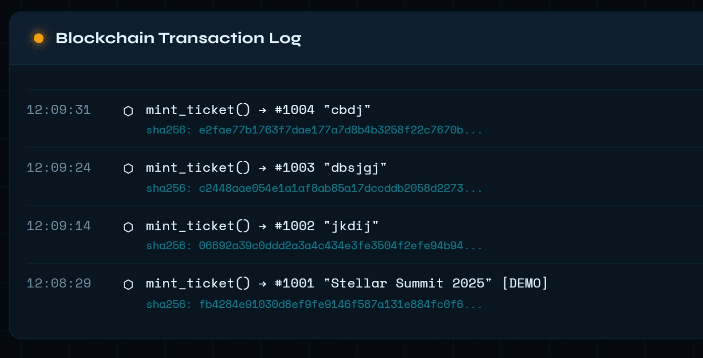

# 🎟️ Soroban NFT Event Ticketing Smart Contract

---

## 🧾 Project Title

**Decentralized NFT-Based Event Ticketing System on Soroban**

---

## 📖 Project Description

This project implements a **decentralized NFT-based ticketing system** using the **Soroban smart contract platform** on the **Stellar blockchain**.

Each ticket is represented as a **Non-Fungible Token (NFT)** with a unique identity and ownership stored on-chain. The system enables **secure minting, transfer, and validation** of event tickets without relying on centralized authorities.

It eliminates:

* ❌ Counterfeit tickets
* ❌ Duplicate entries
* ❌ Unauthorized resale

By leveraging:

* Blockchain immutability
* Decentralized verification
* Cryptographic ownership

---

## 🎯 Project Vision

To create a **transparent, tamper-proof, and trustless ticketing ecosystem** where:

* Users fully own their tickets
* Event organizers can issue verifiable NFTs
* Ticket validation is done securely on-chain

### 🌍 Long-Term Goal

Build a complete **Web3 ticketing infrastructure** for:

* Concerts 🎵
* Sports ⚽
* Conferences 🎤

---

## 🧠 System Components

### 🔹 1. Smart Contract (Soroban)

* Written in Rust (`#![no_std]`)
* Handles core logic:

  * Ticket minting
  * Ownership tracking
  * Ticket validation
  * Transfer control

---

### 🔹 2. Blockchain Layer (Stellar Testnet)

* Stores ticket data on-chain
* Ensures:

  * Immutability
  * Transparency
  * Security

---

### 🔹 3. Storage Layer

* Uses **Soroban Instance Storage**
* Key-value based persistent storage
* Efficient on-chain data management

---

### 🔹 4. User Interaction Layer (CLI / Future DApp)

* Interact via:

  * Soroban CLI
  * Future Web3 frontend

---

## 🏗️ System Architecture

```id="f1p0x9"
User → CLI / DApp → Soroban Smart Contract → Stellar Blockchain
```

---

## 📁 Project Structure

```id="l9u5av"
NFT-Ticket/
├── contracts/              # Smart contract source code
│   ├── src/
│   │   └── lib.rs          # Core contract logic
│   ├── Cargo.toml          # Contract dependencies
│   └── README.md
├── Cargo.toml              # Workspace configuration
├── Cargo.lock
├── target/                 # Compiled output
└── README.md               # Project documentation
```

---

## ⚙️ Prerequisites

Before running this project, ensure you have:

* 🦀 **Rust & Cargo** (latest version)
* 🌐 **Soroban CLI (stellar CLI)**
* 💻 **Git**
* 🧪 **Stellar Testnet account**

---

## 🚀 Getting Started

### 🔹 1. Clone Repository

```id="0y0q1z"
git clone https://github.com/rishitha-rgb/NFT-Ticket.git
cd NFT-Ticket
```

---

### 🔹 2. Build Smart Contract

```id="6vj7cz"
cargo build
```

---

### 🔹 3. Compile to WASM

```id="w1o9pm"
cargo build --target wasm32-unknown-unknown --release
```

---

### 🔹 4. Deploy Contract

```id="m8bz6o"
stellar contract deploy \
--wasm target/wasm32-unknown-unknown/release/contract.wasm \
--network testnet
```

---

## ✨ Key Features

### 🪙 NFT Ticket Minting

* Unique ticket ID generation
* Owner association
* Event metadata binding

---

### 🔍 Ticket Query

* Retrieve ticket details
* Transparent verification

---

### ✅ Ticket Validation

* Mark ticket as used
* Prevent reuse

---

### 🔁 Ownership Transfer

* Transfer before usage
* Disabled after validation

---

### 🧱 Tamper-Proof Storage

* Immutable blockchain storage

---

### 📜 Logging & Auditability

* Track all transactions

---

## ⚙️ Smart Contract Functions

| Function Name                           | Description          |
| --------------------------------------- | -------------------- |
| `mint_ticket(owner, event_name)`        | Creates NFT ticket   |
| `view_ticket(ticket_id)`                | Fetch ticket details |
| `use_ticket(ticket_id)`                 | Validate ticket      |
| `transfer_ticket(ticket_id, new_owner)` | Transfer ownership   |

---

### 🧪 Function Signatures

```rust id="0m8l5f"
pub fn mint_ticket(env: Env, owner: Address, event_name: String) -> u32;
pub fn view_ticket(env: Env, ticket_id: u32) -> Ticket;
pub fn use_ticket(env: Env, ticket_id: u32);
pub fn transfer_ticket(env: Env, ticket_id: u32, new_owner: Address);
```

---

## 🔐 Data Model

| Field      | Type    | Description       |
| ---------- | ------- | ----------------- |
| ticket_id  | u32     | Unique identifier |
| owner      | Address | Ticket owner      |
| event_name | String  | Event name        |
| is_used    | bool    | Usage status      |

---

## 🧩 Tech Stack

| Layer      | Technology          |
| ---------- | ------------------- |
| Language   | Rust (`#![no_std]`) |
| Blockchain | Soroban (Stellar)   |
| SDK        | soroban_sdk         |
| Storage    | Instance Storage    |
| Deployment | Soroban CLI         |

---

## 🚀 Future Scope

* Wallet integration (Freighter)
* Frontend DApp interface
* NFT resale marketplace
* QR-based ticket validation
* Metadata extension (VIP, seat info)
* Cross-chain interoperability

---

## 🔒 Security Features

* Ownership validation
* Anti-duplication mechanism
* Immutable storage
* Controlled state transitions

---

## 📦 Contract Details

**Contract ID:**

```id="6yr7bc"
CCM7X7Z7GJYTFT5YWJSFRNHBK2UTH452ZX4XV6VJ2SNDXSJRU63UK7P6
```

---

## 🖼️ Output



---

## 👥 Contributors

* **Rishitha Suhani D Souza**
* **Manya Sohan D.H**

---

## 📝 License

This project is developed for **educational and blockchain learning purposes**.

---
